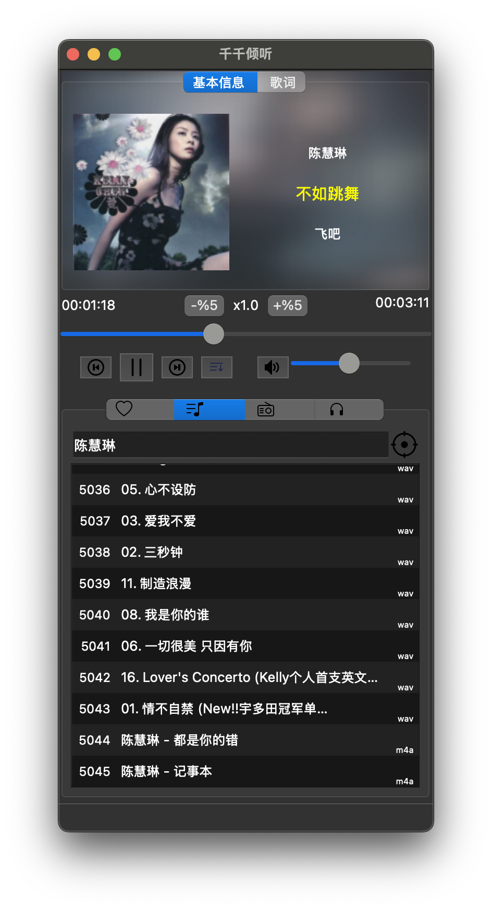
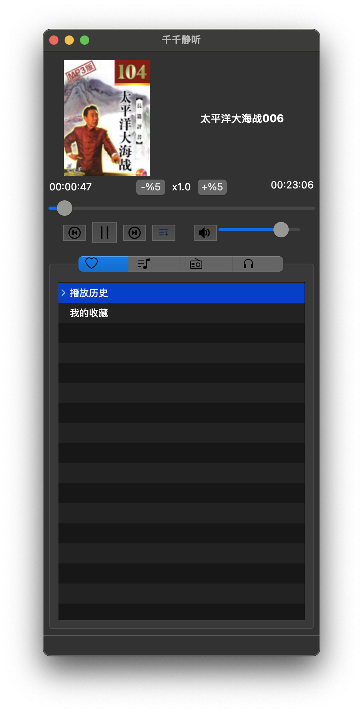
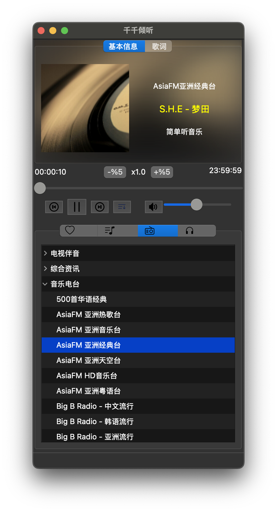

# 音乐播放器

欢迎使用我们的音乐播放器！这是一个功能强大且易于使用的音乐播放器，支持多种音频格式，并提供丰富的播放控制功能。

## 主要功能

- 支持 MP3, WAV, FLAC, APE, ALAC, DSF 等等多种音频格式，几乎所有的音乐文件都可以播放。
- 电台播放
- 评书有声小说播放
- 播放列表管理
- 音量控制
- 播放进度控制
- 歌词显示

## 界面展示

以下是音乐播放器的界面截图：

## 安装与使用

1. 下载并安装音乐播放器。
2. 打开应用，导入您的音乐文件。
3. 开始享受音乐吧！

## 反馈与支持

如果您有任何问题或建议，请通过 [GitHub Issues](https://github.com/yzzyzz/qianqianrelease/issues) 联系我们。